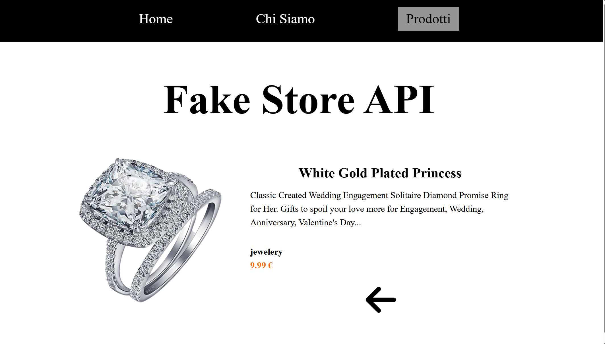
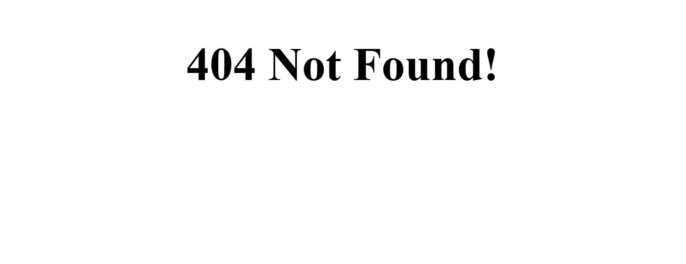

  

<h1 align="center">React Router Store</h1>

Interfaccia frontend sviluppata con React che simula un mini e-commerce, con navigazione multi-pagina e routing dinamico.

---

## Obiettivo

### Prima parte – Navigazione e pagine principali

- Creare il frontend di un mini e-commerce
- Implementare il routing tramite React Router DOM
- Realizzare le seguenti pagine principali:
  - **Homepage**, con contenuto di benvenuto o immagine promozionale
  - **Chi siamo**
  - **Prodotti**, con lista di prodotti recuperati da API
- Integrare una **Navbar** visibile in tutte le pagine
- Recuperare i dati dei prodotti da Fake Store API

**Bonus**
- Centralizzare la Navbar tramite un componente `Layout`
- Gestire lo stato attivo dei link nella Navbar

---

## Anteprima – Pagine principali

---

### Seconda parte – Dettaglio prodotto e routing dinamico

- Rendere cliccabili i prodotti nella pagina di listato
- Implementare una pagina di dettaglio prodotto
- Recuperare i dati del singolo prodotto tramite parametro dinamico `id`
- Configurare il routing dinamico per la lettura dell’ID dalla URL

**Bonus**
- Gestire la navigazione programmatica in caso di prodotto non esistente
- Aggiungere una pagina **404**
- Implementare uno stato di **loading** durante il caricamento del dettaglio prodotto

---

## Anteprima – Dettaglio prodotto
 

**Prodotto cliccabile dalla lista (interazione hover)**
 

 

**Stato di caricamento del dettaglio prodotto**

 

**Pagina di dettaglio del singolo prodotto**

 

**Pagina 404 per prodotto non trovato**

 

## Tecnologie utilizzate

- React
- React Router DOM
- JavaScript
- Axios
- CSS3
